# Algorithms for Data Science (ADS) 
## Programming Assignment 1
### JL Lemma
#### Question 1

Each instance of M is i.i.d N(0, 1), and we are taking enough samples (10000), its respective angle with respect to the X-axis (or the vector e(0, 1)) is uniformly distributed from 0 to 180 degrees.

**Note**: I have considered the unsigned angle (i.e from 0 to 180 degrees) using the standard dot product formula. 

**Generated Histogram**:
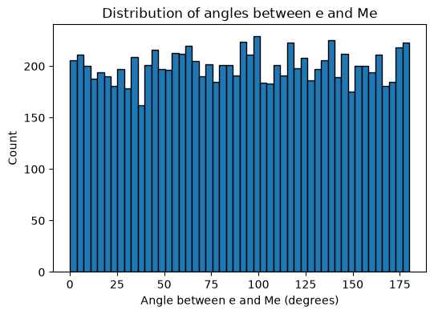

#### Question 2
For obtaining the value of k, this is the upper bound formula used:
$$k \geq \frac{4\ln n}{\epsilon^2/2 - \epsilon^3/3}$$

This formula does not consider the failure probability $\delta$ that professor considers in the lecture, however after the formula in the lecture is simplified and $\delta$ is treated as a constant, the asymptotic complexity of the bound remains the same. 

Here, k comes out to be **1966**.
Then we generate the random projection matrix R, which is a k x d Gaussian random matrix scaled by 1 / sqrt(k) so that `E[||Rx||^2] = ||x||^2`, i.e. it preserves squared length in expectation.

Then, we try generating the random matrices in a loop for validation whether the guarantee holds. It does hold, and the empirical observation is that I needed to generate just **1** random projection matrix that satisfied the given range and epsilon value.

#### Question 3
This question asks to compare the pair-wise square distances between points in the projected feature space as compared to the original space. Different values of k are used to denote the sizes of the lower dimension to project to.

We compare 3 heatmaps:
k = 100
k = 500
k = 1500

Just as given in the assignment, I have considered the x axis as the original dimension and the y axis as the transformed dimension. 

**Heatmap**:
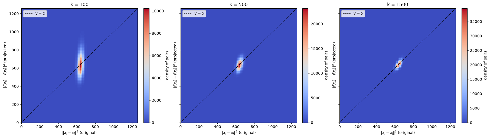

The above heatmap shows what is expected: higher the value of k, more is the concentration of the distances around the true distance. 

k = 100 has widest vertical spread around the diagonal and k = 1500 is the tightest.

**Note**: From the diagram, one more thing is observed. The original distances all cluster tightly around ~640 on the x-axis. This is because the data is i.i.d. Bernoulli(0.2), and **640** is the expected squared distance. 

#### Question 4
The data cell given to us in this question is a perfectly linearly seperable dataset. This is confirmed by the Perceptron accuracy in d = 2000, which is 100%.

The experiment further tells us to construct random projection matrices (R) like in the earlier question to multiple values of k ranging from 100 upto 1000 (with intervals of 50).

This single experiment is run 50 times and the accuracies are averaged for each value of k. 

**Plot**:
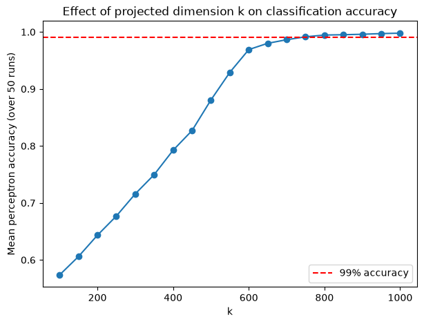

**Observations**:
Accuracy rises smoothly and monotonically with k, from ~57% at k=100 up to ~100% at k=1000, crossing the 99% threshold at **k = 750** (mean accuracy 0.9915 over 50 runs).

One more nice observation is that a much smaller value of k is needed to preserve the geometry or linear seperability as compared to the second question (distance preservation).

### LSH
#### Question 1
1. The first sub-question asks us to plot the probability of collision of two points x and y as a function of ||x - y||.

**Plot**:
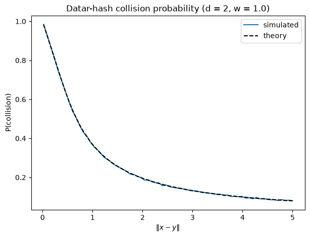

I have considered d = 2 and w = 1 for this experiment. As mentioned in the assignment, the function that I have written is generic and accepts any value of d.

**Observation**:
As the distance between x and y increases, the probability of collision monotonically decreases. Collision means being mapped to the same bucket/value, hence, the above observation is expected.

2. For this problem, I set up a parameter 't', which helps us to generate random (x, y) pairs of vectors. 
`y = x + t * direction`, and the values of x and direction that I considered were:

| Pair	| x (anchor) |	direction (unit vector) |
| ----- | ----- | ----- |
| 1	| (0, 0) | (−0.985, −0.170) | 
| 2	| (1.396, 4.288) | (−1.000, 0.028) | 
| 3	| (14.912, 18.436) | (−0.121, 0.993) | 
| 4	| (0.467, −0.689) | (0.918, 0.396) | 

**Plot**:
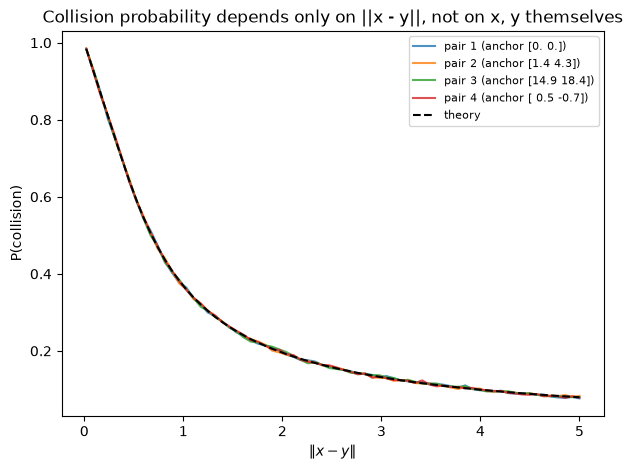

**Observation**:
The individual x and y points do not matter if the distances between them are the same. 

3. r=0.5, c=4 → p1 = 0.611, p2 = 0.196
These are values obtained after multiple trials (2,00,000) of running the function by plugging in the values of r and c.

4. p1=0.8, p2=0.1 → r ≈ 0.253, c ≈ 15.87 
These values are obtained by inverting the simulated curve.

5. I studied the effect of the curve on the following values of w: 0.5, 1.0, 2.0 and 4.0.

**Plot**:
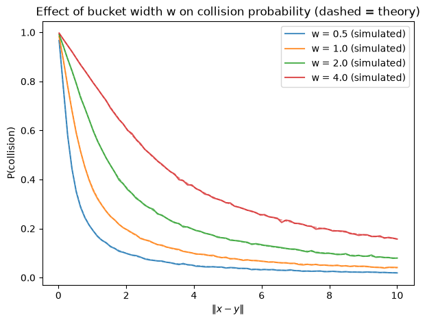

**Observation**:
Since w controls the bucket width, larger w shifts the whole curve rightward/upward, i.e bigger buckets tolerate more seperation before a collision becomes unlikely.

6. As given in the assignment, I tried varying the original dimension **d**, values: 10, 100, 1000.

**Plot**:
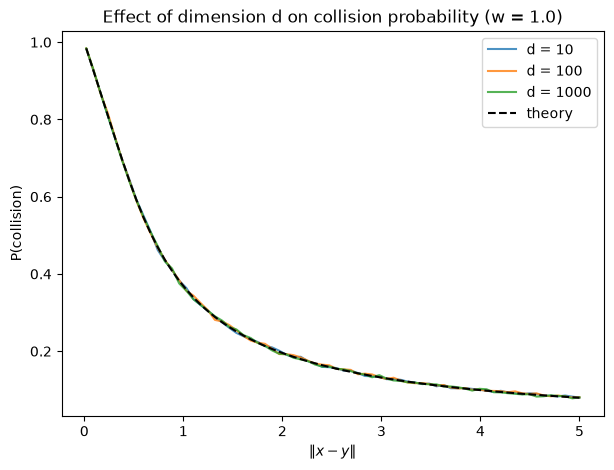

**Observation**:
Varying the value of d has no effect on the curve. This is because the quantity that determines collision is D = aᵀ(x−y), and for a ~ N(0, I_d), D is Gaussian with variance exactly ‖x−y‖², independent of d.

#### Question 2
1. The total number of points (n) in the dataset are 10000. By considering the given values:
r = 1
c = 3
the total number of neighbours, strangers and points in the gray zone (between r and cr) are:
Neighbours (dist <= r=1):        37
Strangers  (dist >  cr=3):       8293
Gray zone  (r < dist <= cr):     1670
Total:                           10000

2. We choose the value of w which gives us the maximum seperation between points, or in other words, smallest value of rho, which exactly measures this. 
rho = ln(1/p1)/ln(1/p2)

**Plot**:
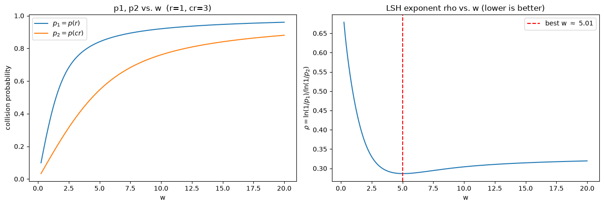

The chosen value of w is 5.0 (as the plot shows lowest value of rho at w = 5). The values of p1 and p2 for this plot given this w are:
p1 = p(r=1)  = 0.8404
p2 = p(cr=3) = 0.5451

3. We want
- theta = target probability that a true neighbour is found by at least one of the L tables.
- k is chosen so that, in expectation, about one stranger out of n falsely collides with the query per table: n * p2^k ~= 1.
- L is chosen so that P(neighbour found) = 1 - (1 - p1^k)^L >= theta.

By choosing theta = 0.9, the values that we obtain are:
theta = 0.9
rho = 0.2865
k = 16
L = 37
Sanity check: p1^k = 0.0619, p2^k = 0.000061
P(neighbour found by >=1 of L tables) = 0.9061
Expected # strangers colliding with query per table = 0.6069

4. By constructing L hash tables each of length k, the results obtained were:
TP = 37, FP = 1, TN = 8292, FN = 0
Precision = 0.9737
Recall    = 1.0000

This is a pretty good result, every true neighbour was retrieved, and only 1 of 8293 strangers was a false positive. The theoretical guarantee was for recall >= theta = 0.9 in expectation, but this run achieved a perfect 1.0.

This proves that LSH did solve our problem to a large extent.

### Randomized SVD
#### Question 1
**Image rendering of A**:
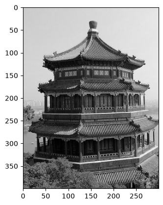

1. The rank-25 approximation of A (B) computed using the built-in SVD function of NumPy, renders to something like:
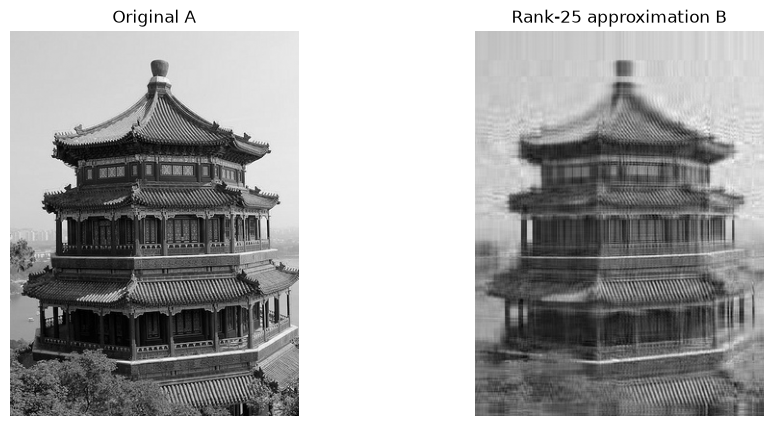

The error (|| A - B ||2) is calculated, and comes out to be:
1260.8865

According to the theory (also explained by prof in the lecture), this also corresponds to the first dropped singular value, i.e sigma_26.

2. The elbow point obtained after plotting the singular values is exactly 25. So, the value of k is 25 and the value of sigma_25 = 1260.8865.

**Plot**:
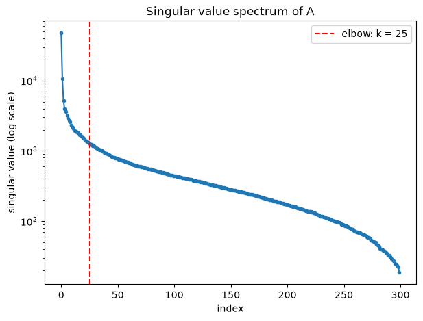

3. By observing the above quantities, we are basically asked to compare the performance of randomized SVD with a given oversampling parameter (p) to the actual error with normal SVD.
The following ratio comes out to be:
||A_hat - A||_2 / ||B - A||_2 = 2.3385

The randomized approximation's error was about 2.3× the optimal (deterministic) rank-25 error.

4. For each value of the oversampling parameter p, we sample 50 values and average over them to estimate the expectation of ||A_hat - A||_2. 

The values obtained for each p are:
p =  5: mean ratio = 2.0728
p = 10: mean ratio = 1.8768
p = 15: mean ratio = 1.7421
p = 20: mean ratio = 1.5625
p = 25: mean ratio = 1.4923

**Plot**:
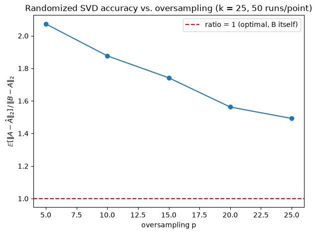

**Observation**:
Averaging over 50 runs each, the ratio drops steadily as oversampling p increases: 2.07 → 1.88 → 1.74 → 1.56 → 1.49 for p = 5,10,15,20,25. More oversampling gives the random test matrix a better chance of capturing the true top-k singular subspace, so the approximation converges toward the optimal B.

#### Question 2
The following plot shows the singular values from the SVD of matrices `(AA_T)^qA` for q in 0, 1, 2, 3, 4, 5. 
**Plot**:
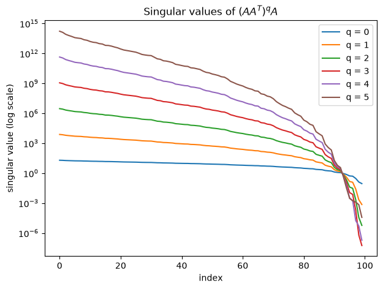

Near index 90, where sigma_i is approx equal to 1, we observe a crossover point in the graph (since exponentiation works in opposite ways when sigma > 1 and when sigma < 1).

- Above σ=1: each successive q pushes the curve up exponentially, by q=5, the top singular value has gone from ~10² (q=0) to ~10¹⁵.
- Below σ=1: each successive q pushes the curve down exponentially instead, by q=5, the smallest singular values are down near 10⁻⁷ or lower.

#### Question 3
I downloaded the LFW dataset (Labeled Faces in the Wild), fetched via `sklearn.datasets.fetch_lfw_people`. It ships 13,233 face images. 

The mean_face is calculated for centering the dataset. I have visualized the mean face too:
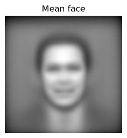

Then, using the sklearn API for PCA and using the randomized SVD as solver, here is the plot for sigma_i versus i. 

**Plot**:
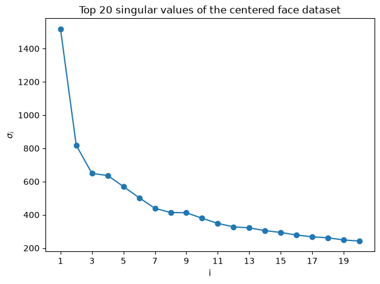

**Observation**:
There's a steep drop from sigma_1 = 1518 to sigma_2 = 820, then a much gentler decline, indicating a dominant mode of variation.

Visualizing the first 20 principal components, we get the following plot:

**Plot**:
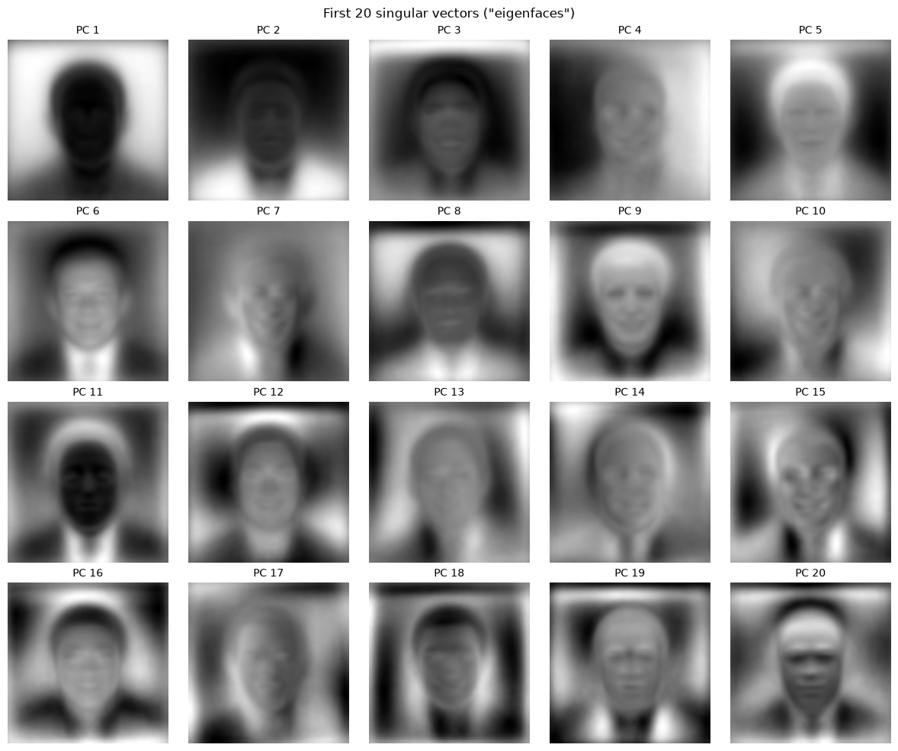

**Observation**:
As expected, the features become more and more clear as the number of principal components that we project onto increase.

### Spectral Clustering
#### Question 1
The weight matrix (W) which has shape (150, 150) is calculated by using the formula given in the assignment as a distance metric -- first we calculate the squared distances between all pairs of points, and then the similarity as follows:
$$W_{ij} = \exp\left(-\frac{|x_i - x_j|^2}{2\sigma^2}\right)$$

The degree matrix (D) which has shape (150, 150) is calculated by adding up all rows of W and then placing them across a diagonal, with non-diagonal entries as zero.

The graph Laplacian matrix (L) which has shape (150, 150) is just elementwise subtraction: `L = D - W`. All rows of L sum to exactly zero.

The 3 smallest eigenvalues of L are:
9.17530101e-15 
5.93915504e-02 
8.44207638e-01

The normalized 2d embeddings corresponding to the 2 smallest non-zero eigenvalues look like follows.

**Plot**:
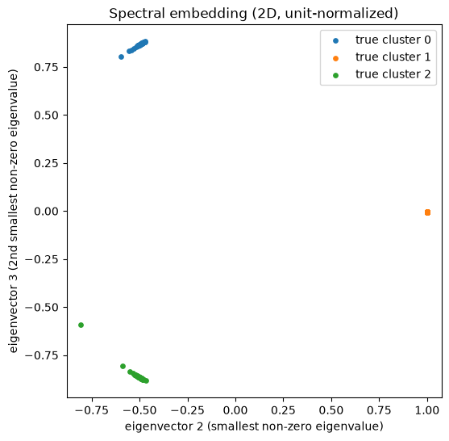

Running k-means with k = 3 on this dataset yields the following result.

**Plot**:
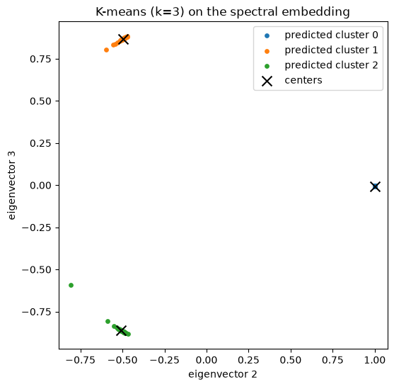

**Observation**:
K-means achieves 100% clustering accuracy.

#### Question 2
The 2 datasets that we are given to work with are:
- Noisy Circles dataset
- Two Moons dataset

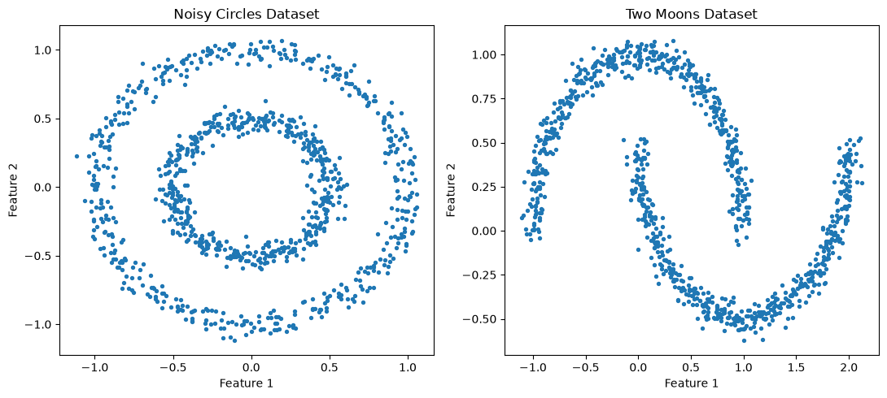

The metric that I used to evaluate the algorithms on the 2 datasets was ARI (Adjusted Rand Index), which compares 2 clusterings of the same data, here we compare the predicted clusters against the known ground-truth labels.

So, k-means fails because of its voronoi-region assumption, and spectral clustering with default parameters also does not give great results.

So the hyperparameters that I tuned for spectral clustering are:
- affinity: rbf and nearest neighbours
rbf is the default like we did it in question 1, while nearest neighbours connects each points only to its `n_neighbours` closest points.

- gamma (only when affinity = rbf) controls how fast similarity decays with distance.
- n_neighbours (only when affinity = 'nearest neighbours') number of neighbours.

**Plot**:
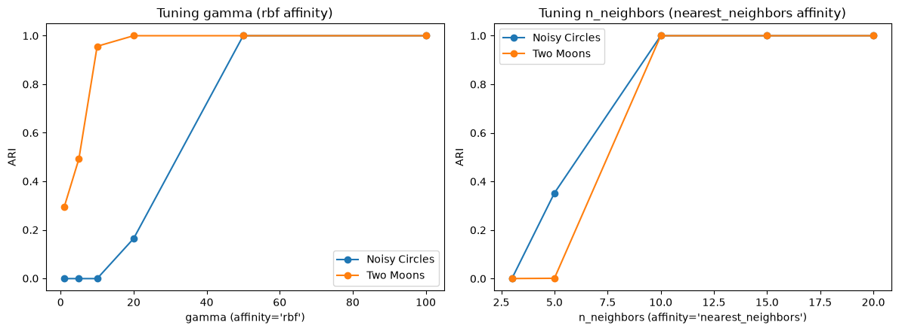

So, affinity = 'nearest neighbours' and n_neighbours = 10 gave the perfect ARI for both datasets, and here's the final comparison plot.

**Plot**:
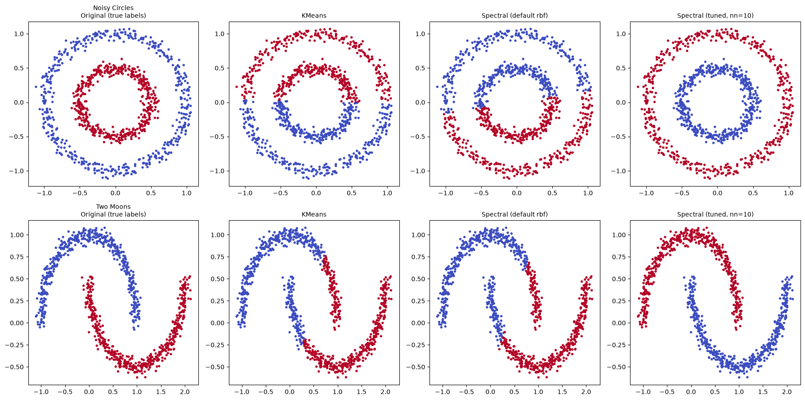

#### Question 3
For this question, I downloaded the flower.jpg which comes bundled with sklearn's API. 
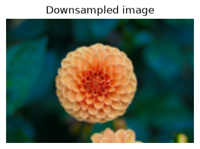

Each pixel is represented as a feature vector [R, G, B, x, y]. Experimenting with different values of k, here are the results:

**Plot**:
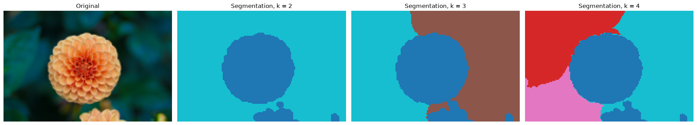

**Observation**:
At k=2, the flower is cleanly isolated from the leafy background including its small secondary bud; at k=3–4, finer structure emerges (splitting the flower's warm center from its outer petals, and splitting the background by lighting/color).